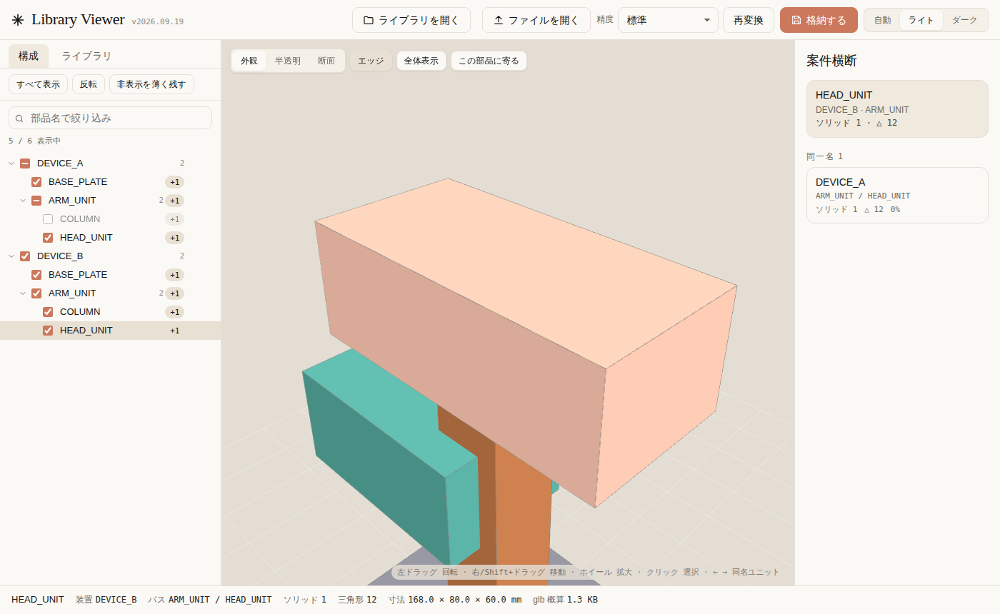

# Library Viewer

設計者が Fusion で作った STEP を共有フォルダに集めて、**誰でもダブルクリックで 3D 表示**できる社内ツールです。
サーバーもインストールも不要。CAD データは PC の外に出ません。



## 使う人（見るだけ）

1. 共有フォルダ（ライブラリ）にある `library-viewer.html` をダブルクリック（Chrome / Edge）
2. 「ライブラリを開く」で共有フォルダを選ぶ → 格納済みの装置が「ライブラリ」タブに並ぶ
3. 「開く」で 3D 表示。構成ツリーのチェックで部品の表示 / 非表示、クリックで選択、断面・半透明・エッジ表示
   - **計測**（`M` キー）: 距離（2 点）と角度（3 点）。頂点・**穴の中心**・エッジ・面にスナップします
     - 穴の中心は円を当てはめて求めるので、径と中心間距離は CAD の公称値と一致します（誤差 1/1000 µm 以下）
4. 複数の装置を「追加」で読み込むと、同名ユニットを右パネルで横断比較（← → キーで順送り）
5. 落とした STEP は構成ツリー上で整理できます（VS Code のエクスプローラと同じ操作）
   - 新しいフォルダーを作り、行をドラッグして入れる。`F2` か右クリックで名前の変更
   - `Shift`/`Ctrl`+クリックで**複数選択**し、まとめてドラッグ移動。右クリックの
     「選択した N 件を新しいフォルダーへ」なら 1 操作で振り分けられます
   - 整理はビューアの表示だけで、元のファイルは動きません
6. 「この部品に寄る」は、**いちばんよく見える角度まで回り込んでから**寄ります
   （板の裏に付いた部品なら、板の下へ回り込んで見上げます）
7. 画面から外したい装置は構成ツリーの装置行の × で閉じる。ライブラリから消したいものはカードの「削除」

STEP ファイルやフォルダを直接ウィンドウにドロップしても見られます。
**フォルダを渡すと中の STEP だけを読み込み、フォルダの階層をそのまま構成ツリーに再現します**
（STEP 以外のファイルは読み込みません）。

## 格納する人（設計者）

STEP のファイル名を **`案件コード_装置名_対象ワーク_部署_担当者.step`** の形にしておけば、格納先の階層は自動で決まります
（例: `P2026-001_検査装置A_ワークX_設計1課_山田.step` → `models/設計1課/P2026-001_検査装置A/ワークX/`）。
ルールはビューアの「ルール」から変更でき、ライブラリ全体で共有されます。

- **受信箱に置くだけ**: 共有フォルダの `inbox/` にコピー → 次に誰かがビューアを開いたとき「取り込む」で一括格納（自動取り込みも可）
- **Fusion から**: `fusion/LibraryExport` をスクリプトとして登録 → 実行 → 案件情報を入力 → 格納。ファイル名もルールどおりに付きます
- **ビューアから**: STEP をドロップ → 「格納する」（ファイル名がルールに合っていれば入力済みで開きます）

いずれも管理者の作業はありません。

詳細は [docs/ライブラリ運用.md](docs/ライブラリ運用.md)。

## 開発

**DirectCloud は必要ありません。** ビューアはローカルフォルダを開いているだけなので、
手元にサンプルのライブラリを作れば全機能をそのまま確認できます。

```
npm install
npm run build            # → dist/library-viewer.html (約 4.7 MB)
npm run sample           # → sample-library/ (装置 3 件・受信箱・名簿つき)
npm test                 # STEP / GLB / ZIP / ブラウザ通しテスト
```

`sample-library/library-viewer.html` をダブルクリックし、「ライブラリを開く」で `sample-library` を選べば動きます。
手順と確認項目は [docs/自宅で開発する.md](docs/自宅で開発する.md)。

### 重いファイルについて

STEP の変換時間の大半は解析と B-rep 構築で、**メッシュ精度を下げても速くなりません**。
そのかわり次の 2 つで体感を詰めています。

- **変換キャッシュ**: 一度開いたファイルは結果を保存し、次からは読み直すだけ（実測 3.9 秒 → 38 ミリ秒）
- **ワーカーで変換**: 変換中も画面が固まらず（54 fps）、複数ファイルは**できた端から表示**されます

キャッシュは同じファイル・同じ精度のときだけ使われ、古いものから自動で整理されます
（手動で消す導線も、再利用したときの案内に付いています）。

構成・制約は [CLAUDE.md](CLAUDE.md)、仕様は [docs/開発プロンプト.md](docs/開発プロンプト.md)。
